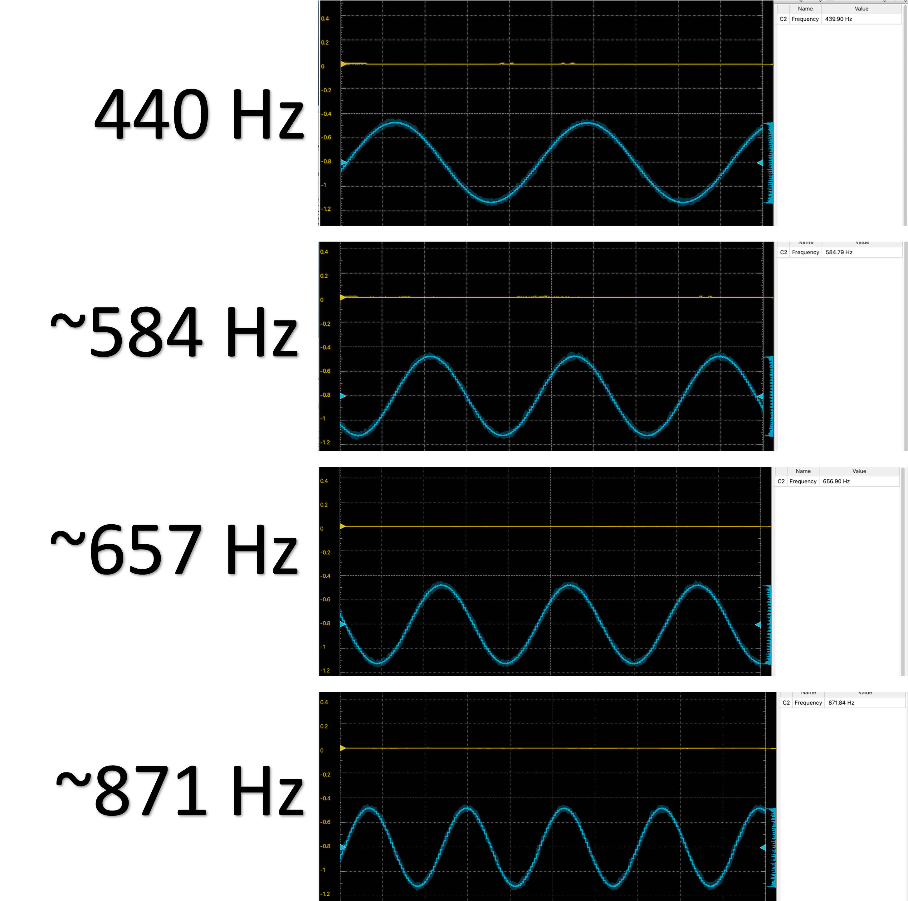

# ASS7_GettingInTune
This repository contains the source code for the "Getting In Tune" HW. Outlined in this README are the main deliverables (including EC), and also a picture of the sin wave produced.

# Deliverables
* Code elegance - all of the code is written to style, with #defines and header files used appropriately. Analog_in and Analog_out are not used, instead ADC.c/h and DAC.c/h are used. 
* Sin function - this was computed soley with integer math. The following are found: "max_err=1 sum_sq=9280" (within range)
* Analog Output (DAC.c/h) - works as expected with a 48000 Hz sampling rate. 
* Analog Input (DAC.c/h) - works as expected with a 48000 Hz sampling rate. 
* oscilloscope validation - BELOW

# Oscilloscope

An Analog Discovery 2 was used to observe the sin waves over time. Shown below are the sin waves and calculated frequencies using the corresponsing software, WaveForms.

